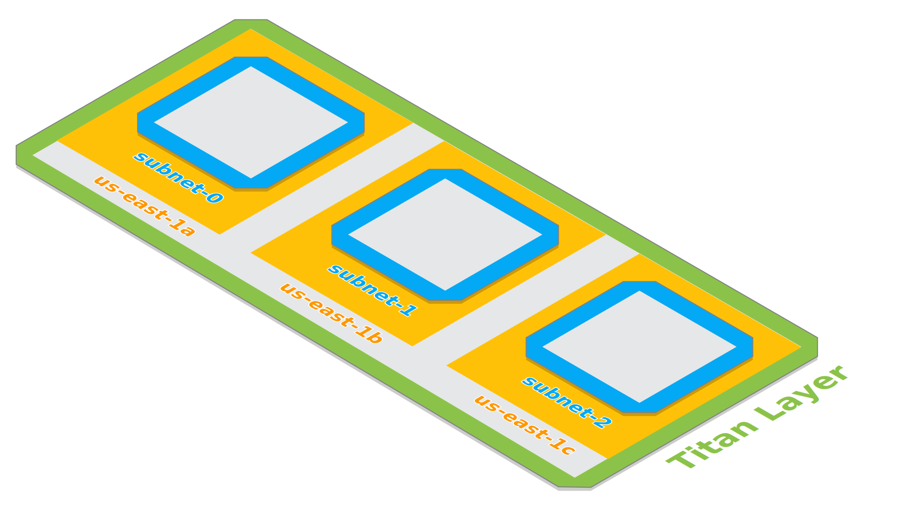
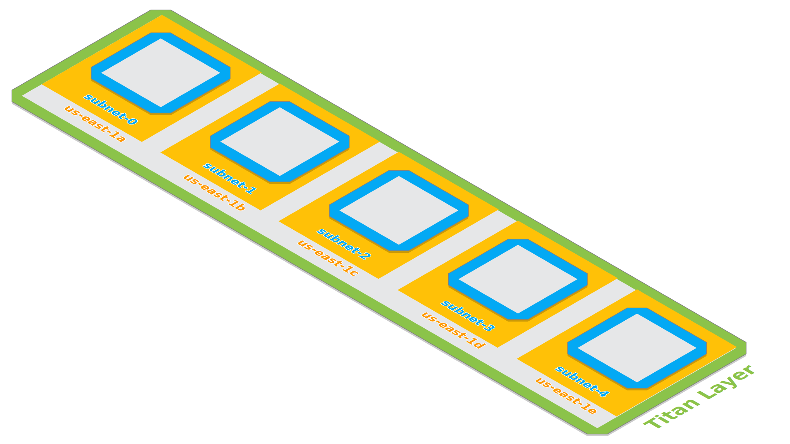

Titan Layers
============

A Titan *Layer* is a group of subnets, route tables, network ACLs, and other relevant resources all allocated for
a single logical purpose.

There are five default Titan Layers included in every Titan Network:

#. **DMZ**: Public, WAN-facing resources.
#. **Routing**: Private, layer 5-7 routing resources. (e.g. routing of TCP/UDP/HTTP packets/sessions/data)
#. **Services**: Private, usually stateless web, compute, and asynchronous worker services.
#. **Data**: Private, stateful data stores. (e.g. MySQL, Redis, Kafka, Elasticsearch)
#. **Admin**: Private, administrative services. (e.g. ZooKeeper, etcd, Logstash, Nagios)

It is possible to add additional arbitrary Titan Layers to a given Titan Network.

Layers scale to the amount of availability zones specified.

Diagrams
--------

Isometric diagrams are provided here which show the way that Titan Layers are organized.

Small, Single-AZ Layers
^^^^^^^^^^^^^^^^^^^^^^^

Here is a diagram of a small, single availability zone Titan Layer:

.. image:: ../../../site/layer/titan-layer-small-no-grid.svg
   :width: 100%

Medium, Triple-AZ Layers
^^^^^^^^^^^^^^^^^^^^^^^^

Here is a diagram of the default size of a Titan Layer, spanning three availability zones:

Large, Five-AZ Layers
^^^^^^^^^^^^^^^^^^^^^

Here is a diagram of a large, five availability zone Titan Layer:

------

Next, we'll explore Titan Networks.
